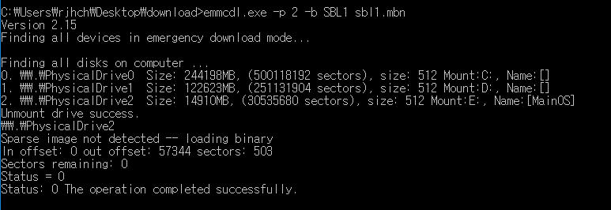

## Dragonboard410 의 SBL, UEFI 메뉴얼 업데이트 하기 

디바이스 USB Storage 모드로 부팅하기 ( Power + Reset 을 함께 누른 후 전원 인가 ) 
디바이스의 USB (J10 포트) 를 PC 의 USB 포트로 연결 
디스크 매니저를 통해 디바이스의 디스크 번호 확인 

Emmcdl.exe -p 2 -gpt 로 파티션 내용 확인 

Emmcdl.exe -p <disk_no> -b <partition name> <image> 로 SBL, UEFI 를 업데이트 할 수 있음 
SBL 업데이트 

UEFI 업데이트 

